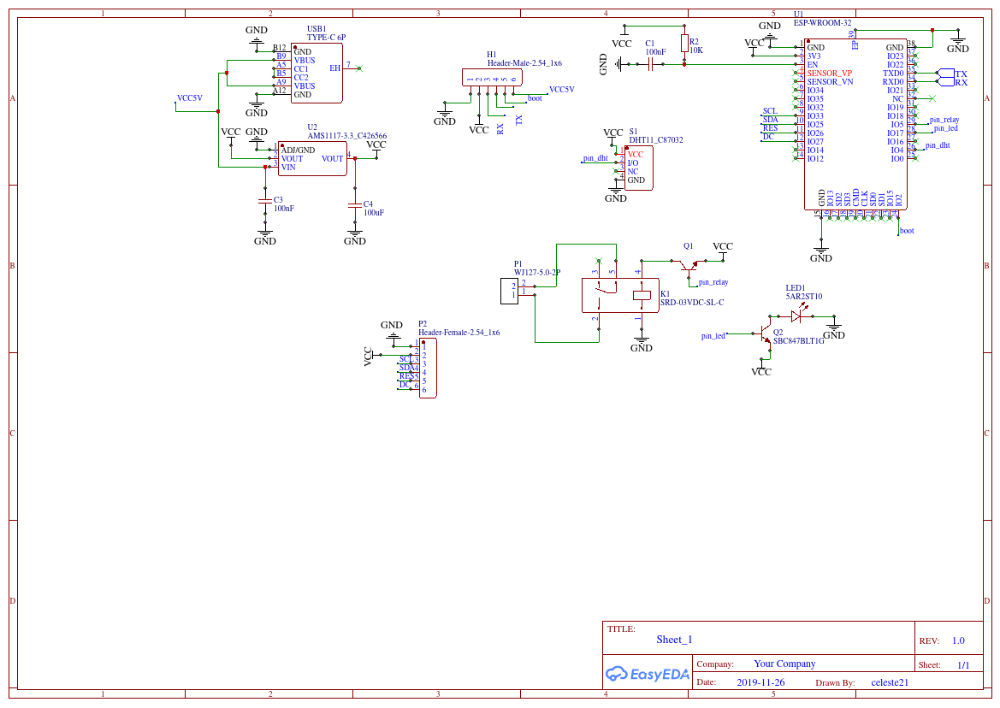
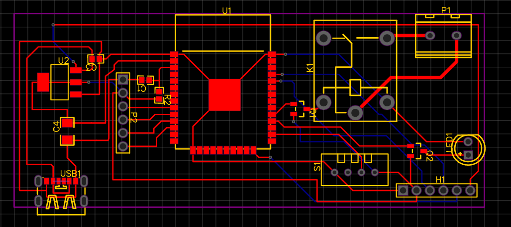

# thermostat connecte utilisant un ESP32 et le protocole MQTT

## fonctionnement

Peut controler un chauffage au sol grace a un relai et controler une clim reversible par infrarouge.  
Ce controle grace a l'application android [thermco](https://github.com/celestecote21/thermCo).  
Utilisation du protocol MQTT grace a la librairie [PubSubClient](https://pubsubclient.knolleary.net/), il recoit un JSON lui donnant les horaires et le jours d'activation ainsi que la temperature a avoir.  
Le relai peut etre programme pour une horaire et un jour specifique a une certaine temperature (programmation de la temperature a 18h quand on rentre chez soi pour que le chauffage ne reste pas allumer tout la journee par exemple).  
Le controle de la clim est lui aussi programme suivant les meme parametres(jour, heure, temperature), et est controle independament du relais.  
la temperature de la piece est envoye au broker pour etre affiche sur l'application, la derniere programation s'affiche aussi sur l'application.
possibiliter d'installer un ecran (dev en cour) ou possibiliter d'ajout d'une carte fille pour de nouvelle fonction, grace au header nommer "screen_header" sur le schemas electronique.

## Utilisation

Le systeme n'est pas autonome (possible d'avoir un fonctionement autonome avec server http voir branche [version_1](https://github.com/celestecote21/thermostat_connecter_arduino/tree/version_1)). Pour fonctionner il a besoins d'un brocker priver (tel que mosquitto) sur resau local ou un brocker public.  
Fournissez ssid et mot de passe wifi ainsi que les informations de connection pour votre brocker, par defaut il va subscrire a Maison/thermostat/set pour recevoir les instructions, et va publier toutes les minutes la temperature de la piece sur Maison/thermostat/get  
L'envoie d'instruction se fait par JSON dans se format:

	{"day":0,"start":18,"finish":20,"set":20,"type":1,"default":"12.0"}

* day: le jour de la semaine de la programmation
* start: l'heure de depart de la mise en route
* finish: l'heure de fin/d'arret
* set: la temperature qu'il doit faire dans la piece
* type: si c'est la geothermie ou la clim
* default: la temperature de base toujours active pour le relais  

Pour le controle de clim une excellente librairie est disponible [ici](https://github.com/crankyoldgit/IRremoteESP8266) repertoriant de nombreuse marque et model.  
Des mises a jours peuvent etre faites a distance en envoyant une url pointant vers un fichier binaire, utilisez apache par exemple.  

## Design PCB

design cree a l'aide d'easyeda, vous pouvez tout retrouver [ici](https://easyeda.com/celeste21/thermco).
\

\

